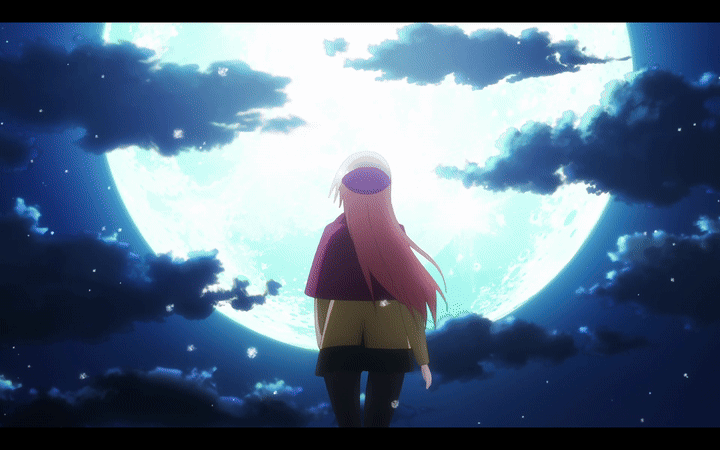

# mpv-filter-presets
Interactive filter preset menu for mpv (F6) with preview and quick switching.

Interactive filter preset menu for **mpv** that lets you quickly switch between different video enhancement profiles.

The script provides a simple on-screen menu to preview and apply presets that combine color adjustments, sharpening, and debanding.

---

## Features

- Interactive preset menu
- Preview presets before applying
- Multiple built-in video enhancement presets
- Debanding and sharpening filters
- Non-destructive preview (ESC restores previous state)
- Lightweight Lua script

---

## Included Presets

- None
- Cinematic
- Cool Tone
- Custom
- Deep Black
- Dramatic
- Ghibli Style
- Neon Pop
- Night Mode
- Nostalgic
- Sharpen
- Soft Pastel
- Vivid
- Warm Tone

---

## How to install

Locate your mpv configuration directory. On Windows it's ususally at `%APPDATA%\mpv\scripts\` and on Linux / macOS at `~/.config/mpv/scripts/`.

Copy the script file: `mpv-filter-presets.lua` into the `scripts` folder.

---

## How to use

Press: `F6` to bring the filter menu. Use up or down key ↑ / ↓ to preview presets, enter to apply the preset >> ESC to close the menu
